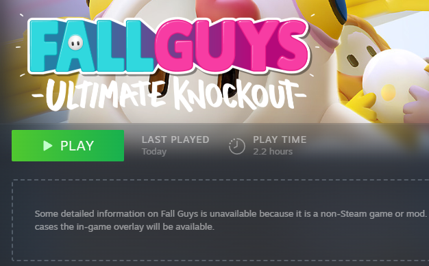

# Non-Steam Playtimes <a href='https://ko-fi.com/X8X554X28' target='_blank'>☕</a>

A Millennium plugin that tracks playtime for non-Steam games.

## Features

- Automatically tracks how long non-Steam apps are played

- Playtime is visible inside your Steam client alongside your official games

- Session data is stored locally and updates as you play

---

## Prerequisites

- [Millennium](https://steambrew.app/)

## Notes & Troubleshooting

### Data Location

Session data is stored in `<STEAM>/plugins/non-steam-playtimes/sessions.json`. If you ever want to say reinstall your OS and want to keep your non-Steam playtimes, **backup this file** and restore it on the new PC to get your playtimes back.

### Epic Games Launch Fix

For non-Steam games from the Epic Games Store, the selected executable may close itself and hand off launching the game to the Epic Games Launcher. When this happens, Steam stops recognising the game as running. This can often be fixed by either choosing a different target executable or by adding `-epicportal` to the launch options.
